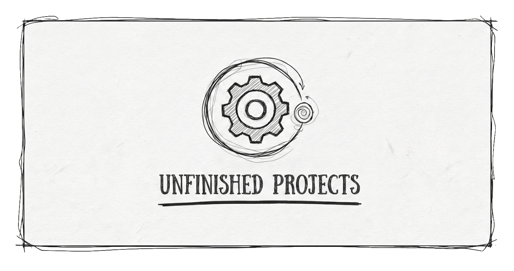

# Unfinished Projects - Landing Page

This is the central gateway for Unfinished Projects, a collaborative hub for tinkerers, artists, and open-source advocates. 

This repository hosts the static landing page found at unfinishedprojects.net. Our wider ecosystem—including the forum and wiki—is self-hosted via Cloudron.

## Our Philosophy

We are a community for the person who always has three half-finished projects sitting on their desk. We value the journey of making, and building community over the noise of social media.

- Libre First: We champion Creative Commons, Open Source software, and the overall Libre movement that counters prevalent capitalist models.
- Value in Diversity: We celebrate the range of people who create as much as the projects they create. Whether it’s a diversity of culture, identity, and background or a mix of skills like 3D printing, gamedev, and TTRPG homebrew—we believe different perspectives and skill sets should cross-pollinate.
- Small & Tightly-Knit: We prefer permanence and commitment over memes and fleeting interactions.

## How to Contribute (The "Dummy-Proof" Guide)

If you are new to Git or GitHub, don't be intimidated. Contributing to an open-source project is a great way to learn. Here is how the process works:

### The Professional Way (Pull Requests)
Think of this like making a copy of a blueprint, marking it up, and then showing me your changes to see if I want to "merge" them into the master copy.

1.  **Fork it:** Click the "Fork" button at the top of this page. This creates a personal copy of this code under your own GitHub account.
2.  **Branch it:** Inside your copy, create a "Branch." This is like a separate folder for your specific idea (e.g., "fix-typo" or "new-color-scheme").
3.  **Edit it:** Change the code in your branch. You can do this directly in the browser on GitHub.
4.  **Pull Request (PR):** Click "Contribute" and then "Open Pull Request." This sends me a notification saying, "Hey, I have an improvement for you to look at."

### The Low-Tech Way
If Git feels like too much right now, that is perfectly fine.
- Just send me a message on the forum or email me the code file with your changes. 
- I can manually update the site for you. This is a collaborative space, and the goal is to improve the site together, regardless of your technical comfort level.

## Community Links

- This Landing Page: https://unfinishedprojects.net
- Forum: https://forum.unfinishedprojects.net
- Wiki: https://wiki.unfinishedprojects.net
- Updates/Blog: https://forum.unfinishedprojects.net/blog

## License

This project is licensed under the **GNU General Public License v3.0 (GPL-3.0)**. 

This ensures that the code remains free and open for everyone. If you improve this site and share it, those improvements must also be shared under the same free license.

✊ United, we can create a better world.